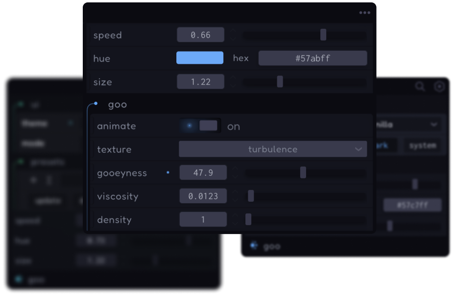

# gooey

### 🚧 _WIP_

A gui library for typescript and javascript.

[gooey.braebo.dev](https://gooey.braebo.dev)

<p align="center">
    </img>
</p>

<p align="center">
    </img>
</p>

## Features

-   [x] Flexible API
-   [x] Thoroughly Typed
-   [x] Dependency Free
-   [x] Preset Manager
-   [x] Theme Manager
-   [x] Draggable / Resizable
-   [x] GUI Generator Methods
-   [x] Reset Buttons
-   [x] Undo History · _wip_
-   [ ] Graphs / Monitors
-   [ ] LFO / Envelope manager
-   [ ] Bezier Curve Editor
-   [ ] Plugins
-   [ ] Svelte Components

## Inputs

| Status | Feature    | Primitive                      |
| ------ | ---------- | ------------------------------ |
| ✅     | Number     | `number`                       |
| ✅     | Text       | `string`                       |
| ✅     | Switch     | `boolean`                      |
| ✅     | Select     | `Array<any>`                   |
| ✅     | Button     | `{ text, onClick, ... }`       |
| ✅     | ButtonGrid | `{ text, onClick, ... }[][]`   |
| ✅     | Color      | `Color \| ColorRepresentation` |
| 🚧     | Range      | `{ min, max }`                 |
| 🚧     | Vector2    | `{ x, y }`                     |
| 🚧     | Vector3    | `{ x, y, z }`                  |

## Install

| Source                                 | Install                     | Import                                         |
| -------------------------------------- | --------------------------- | ---------------------------------------------- |
| [NPM](https://npmjs.com/package/gooey) | `npm install gooey`         | `import { Gooey } from 'gooey'`                |
| [JSR](https://jsr.io/@braebo/gooey)    | `npx jsr add @braebo/gooey` | `import { Gooey } from '@braebo/gooey'`        |
| [CDN](https://esm.sh/gooey)            | `'https://esm.sh/gooey'`    | `import { Gooey } from 'https://esm.sh/gooey'` |

## Import

Create a new `Gooey`.

```ts
import { Gooey } from 'gooey'

const gui = new Gooey()
```

## TODO

## About

I built this to scratch an itch, and to pave the way for more advanced features related to WebGL / WebAudio / audio-reactive 3D in the future.

[tweakpane](https://github.com/cocopon/tweakpane) was the main inspiration for this project. I recommend it over `gooey` -- it's a more lightweight solution with more features and an awesome, highly active developer!

Other, similar projects:

-   [lil-gui](https://github.com/georgealways/lil-gui)
-   [dat.gui](https://github.com/dataarts/dat.gui)
